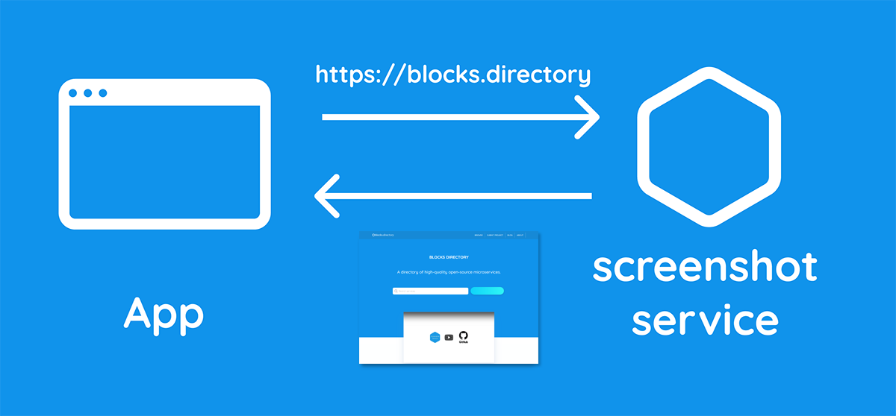

Everyone needs to take a screenshot of a web page programmatically once in a while. 
Sometimes it must be an automated task. 
Or maybe you need to generate a pretty PDF out of your web application report?

A headless browser is your best friend in these cases. Which one should you use? 
You want something modern and well-supported with a nice API. 
That would be headless chrome with the [Puppeteer](https://github.com/puppeteer/puppeteer). Not PhantomJS, please. 
It's not supported anymore.

There are multiple reasons why you'd want to move a functionality like that into a separate microservice. 
Maybe your technical stack isn't JavaScript-related, or you want to reuse it in different applications.
Or you just like microservices. **Like we do at the [blocks.directory](https://blocks.directory)**.

The next question is how you want to run it. 
On a separate machine or set of servers depending on uptime requirements?
Probably not, so let's make it serverless. I bet you won't use it that often. 
And since nobody likes the idea of vendor-lock, use the [Serverless Framework](https://serverless.com/). 
It will make your microservice easier to transfer to other cloud providers or your own servers.
 
Should you add a cache? Maybe. It depends on your use-case. 
If you’re like us and take a lot of screenshots of user website pages and show them throughout an application, then yes. 
It probably makes sense to store them on something like AWS S3. 
It supports object expiration by default and it's very cheap.

And that's the microservice we wrote. 
We also made it available for everyone [here](https://github.com/blocks-directory/screenshot-service). 
We didn't include caching because it will depend on your use case and your environment. 
It's a bit AWS-specific but shouldn't take more than an hour to switch 
to any other cloud provider supported by the Serverless Framework.
